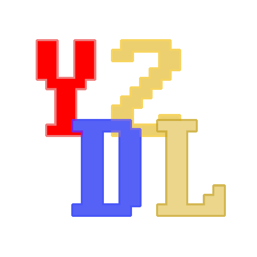

  

# Y2DL (Python version)
 
 

Fetches YouTube or Twitch channel, video, playlist (or others) info and sends it to a human-readable format in a Discord channel.

**Note that this is NOT a YouTube Downloader.**

# Work in progress!
This bot is currently work in progress.